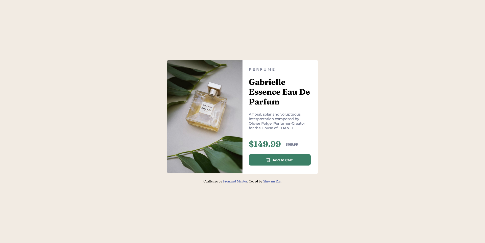

# Frontend-Mentor-Product-preview-card-component
Frontend Mentor challenge to build out this product preview card component and get it looking as close to the design as possible.
# Frontend Mentor - Product preview card component solution
Frontend Mentor challenges help you improve your coding skills by building realistic projects. 

## Welcome! 👋
My work was to build out this product preview card component and get it looking as close to the design as possible.


## Table of contents

- [Overview](#overview)
  - [The challenge](#the-challenge)
  - [Screenshot](#screenshot)
  - [Links](#links)
- [My process](#my-process)
  - [Built with](#built-with)
  - [What I learned](#what-i-learned)
  - [Continued development](#continued-development)
  - [Useful resources](#useful-resources)
- [Author](#author)
- [Acknowledgments](#acknowledgments)

## Overview


### The challenge

Users should be able to:

- View the optimal layout depending on their device's screen size
- See hover and focus states for interactive elements


### Screenshot

Here is my destop preview of this project - 


Here is my mobile preview of this project - 


### Links

- Solution URL: [https://github.com/cwaniraj149/Frontend-Mentor-Product-preview-card-component]
- Live Site URL: [https://cwaniraj149.github.io/Frontend-Mentor-Product-preview-card-component/]

## My process


### Built with

- Semantic HTML5 markup
- CSS custom properties
- Flexbox
- Media Query


### What I learned

While doing this project I used the media query property all by myself after learning it few days ago. 

Basically, through this project, I implemented media query and gain some confidence in this topic.

```html
<h1>Some HTML code I'm proud of</h1>
```
```css
.proud-of-this-css {
  display:flex;
  flex-direction: column; /*flex-direction is row by default.*/
   justify-content: center;  /* Values: flex-start, flex-end, space-around and space-between. */
  align-items: center; /* Values: flex-start, flex-end, stretch and baseline */
}

@media {

}

```
```


### Continued development

I'm still stucking in media queries so I want to continue focusing on it in future projects.


### Useful resources

- [freeCodeCamp.org](https://www.youtube.com/watch?v=1Rs2ND1ryYc&t=13485s) - This helped me in learning CSS. I really liked this pattern and will use it going forward. I'd recommend it to anyone still learning this concept.
- [w3schools](https://www.w3schools.com/) - If you want to recall anything you can visit this amazing website. 


## Author

- Website - [Shiwani Raj](https://cwaniraj149.github.io/personal-website/)
- Frontend Mentor - [@cwaniraj149](https://www.frontendmentor.io/profile/cwaniraj149)


## Acknowledgments

Thanks to all my teachers from whom I learned HTML and CSS.


## Got feedback for me?

I love receiving feedback! I am always looking to improve my projects and enhance my knowledge. So if you have anything you'd like to mention, please comment.

**Have fun building!** 🚀
